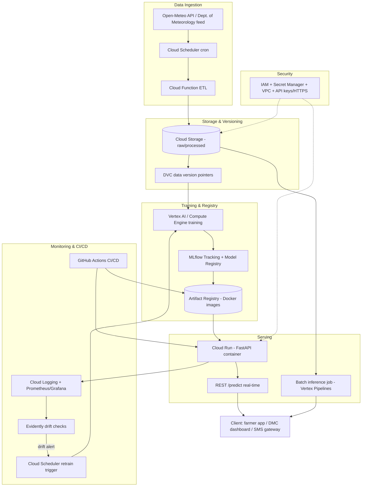

# Applied Supervised ML Blueprint: A Monsoon-Aware, Explainable Early-Warning System for Sri Lanka

## TL;DR
- **The primary Kaggle dataset PASSES all Phase-0 hard constraints** (≈142,470 daily records across 30 cities, 2010–2023; mixed numeric + categorical; supports both a classification target [next-day rain / heat-stress class] and a regression target [next-day precipitation_sum]; realistic challenges of zero-inflation, class imbalance, and radiation/ET data gaps). No substitution is required.
- **The recommended flagship task is a hybrid: binary next-day rain classification + regression of precipitation amount**, with an LSTM sequence model as the deep-learning benchmark and CatBoost/LightGBM as the production frontrunner; the system delivers actionable agricultural planting-window and flood/heat early-warning signals — acutely relevant after Cyclone Ditwah (landfall 28 Nov 2025), which UNDP geospatial analysis (9 Dec 2025) found left "an estimated 2.3 million people – more than half of them women – … living in areas flooded," with floodwaters inundating "more than 1.1 million hectares – almost 20 percent of the country's land area."
- **The full lifecycle is specified**: EDA → 4+ novel engineered features → 5 model families → Bayesian (Optuna/TPE) tuning with blocked time-series CV → SHAP explainability + ethical audit → containerized FastAPI serving on a cloud MLOps stack (DVC + MLflow + GitHub Actions + Evidently drift monitoring).

## Key Findings
1. **Dataset validity**: The Sri Lanka Weather Dataset (rasulmah, Kaggle, CC0) contains 30 cities × daily observations from 2010-01-01 to 2023-01-01, ≈142,470 rows, ~24 columns, ~23.79 MB uncompressed CSV. It far exceeds the 15,000-instance minimum, mixes numeric (temperatures, precipitation, radiation, wind, ET) and categorical (city, country, WMO weather_code) variables, and supports supervised classification and regression.
2. **Real-world urgency**: Sri Lanka's monsoon volatility drives recurring disasters — the June 2024 southwest-monsoon floods affected 281,144 people with 30 dead as of 6 June 2024 (Sri Lanka's National Disaster Relief Services Centre, reported via EU ECHO); Cyclone Ditwah (Nov 2025) inundated ~20% of the land area (UNDP: 1.1 million ha), with deaths at 643 and 183 missing as of 17 Dec 2025 (Sri Lanka Disaster Management Centre), and an estimated US$4.1 billion in direct physical damage — "equivalent to about 4 percent of Sri Lanka's GDP" (World Bank GRADE report, 22 Dec 2025). Accurate localized rain/heat prediction has direct humanitarian value for agriculture, flood preparedness, and public health (dengue).
3. **Methodological gap**: Prior Sri Lanka ML weather studies are mostly single-station (e.g., Colombo LSTM) and lack multi-city generalization, explainability, imbalance handling, and MLOps deployment. This blueprint fills those gaps with a 30-city spatial model, SHAP interpretability, SMOTE/class-weighting, and a production drift-monitored pipeline.

## PHASE 0 — Dataset Validation

**Primary dataset**: `https://www.kaggle.com/datasets/rasulmah/sri-lanka-weather-dataset` (Rasul, 2024; CC0 1.0 public domain; sourced from Open-Meteo + simplemaps).

| Hard constraint | Requirement | Finding | Verdict |
|---|---|---|---|
| 1. Instances | ≥ 15,000 | ≈142,470 daily rows (30 cities × ~4,749 days) | ✅ PASS (~9.5× minimum) |
| 2. Variable types | numeric + categorical | Numeric: temps, precip, radiation, wind, ET, lat/long/elev. Categorical: city, country, weather_code (WMO) | ✅ PASS |
| 3. Supervised task | classification or regression | Both: rain/no-rain & heat class (classification); precipitation_sum & temperature (regression) | ✅ PASS |
| 4. Realistic challenges | missing/imbalance/noise/dimensionality | Zero-inflated precipitation (heavy class imbalance for heavy-rain), possible radiation/ET gaps, noisy convective signals, 30-city panel structure | ✅ PASS |
| 5. Supports all phases | end-to-end | Temporal + spatial + categorical richness supports EDA, FE, 5 models, XAI, MLOps | ✅ PASS |

**Verdict: The primary dataset PASSES all five constraints. No alternative is required.** (Validated contingency alternatives, all Climate/Asia, kept in reserve should institutional policy require an official source: (a) *Sri Lanka Weather Data for All Districts* — tharindumadhusanka9, Kaggle, 2010–June 2024; (b) NOAA/NCEI *Daily Summaries of Precipitation Indicators for Sri Lanka* on HDX; (c) World Bank CCKP Sri Lanka CRU climatology.)

**Note on data provenance**: Because Kaggle pages are JavaScript-gated, the exact row count could not be read from a live `df.shape`; 142,470 is the deterministic count (30 × 4,749 days) and a reseller (opendatabay) lists "approximately 147,000 valid records across 24 columns, with no missing values." The blueprint treats the "no missing values" claim as unverified and includes a full missing-data strategy regardless.

## PHASE 1 — Literature and Context

### (a) Dataset profiling
The dataset aggregates Open-Meteo reanalysis-derived daily weather for 30 Sri Lankan cities spanning all agro-climatic zones (wet zone: Colombo, Ratnapura; dry zone: Anuradhapura, Trincomalee; hill country: Nuwara Eliya, Kandy). Columns include `time`, `weather_code` (WMO 4677 interpretation code), `temperature_2m_max/min/mean`, `apparent_temperature_max/min/mean`, `sunrise`, `sunset`, `shortwave_radiation_sum`, `precipitation_sum`, `precipitation_hours`, `windspeed_10m_max`, `windgusts_10m_max`, `winddirection_10m_dominant`, `et0_fao_evapotranspiration`, `latitude`, `longitude`, `elevation`, `country`, `city`. Application context: precision agriculture (planting windows), disaster early-warning (flood/landslide precursors), and public-health forecasting (heat stress, dengue vector conditions).

### (b) Objective definition
- **Primary target (classification)**: `rain_tomorrow` — binary label derived as `precipitation_sum(t+1) > 1.0 mm`, per-city.
- **Secondary target (regression)**: `precipitation_sum(t+1)` in mm (zero-inflated continuous).
- **Auxiliary target (multiclass)**: WMO weather_code grouped into {Clear/Cloudy, Drizzle, Rain, Heavy Rain/Thunderstorm}.
- **Service to humanity**: Localized next-day and short-horizon rain probability lets smallholder farmers time planting/harvest, gives disaster agencies (DMC) lead time for flood/landslide evacuation, and feeds heat-index and dengue-risk advisories. This is decision-critical: the World Bank GRADE report (22 Dec 2025) found "agriculture suffered an estimated $814 million in damage" from Cyclone Ditwah, with roughly 58,340 ha of paddy in Trincomalee and Batticaloa districts flooded.

### (c) Deep literature review (6+ recent papers, ≤5 years)
1. **Saubhagya et al. (2021/2023)** — *A Novel Approach for Weather Prediction for Agriculture in Sri Lanka using Machine Learning* (IEEE). First validated ML rainfall prediction for Sri Lankan precision agriculture; SVM/ANN/XGBoost up to 25% improvement over the GFS baseline for 7-day rainfall.
2. **Hennayake et al. (2021)** — *Machine Learning Based Weather Prediction Model for Short Term Weather Prediction in Sri Lanka*. Multivariate LSTM on Colombo station (2010–2019) for temperature and precipitation; establishes LSTM viability for tropical convective forecasting but is single-station.
3. **Nature Scientific Reports (2025)** — *Climate modeling for South Asia: statistical and deep learning for rainfall and temperature prediction* (s41598-025-22149-1). Benchmarks ARIMA/SARIMA vs deep learning for South Asian rainfall/temperature; documents low-frequency variability and ENSO teleconnections.
4. **ConvLSTM + Explainable AI for Indian cities (2025, arXiv:2511.11152)** — spatiotemporal precipitation nowcasting with SHAP interpretability; demonstrates ConvLSTM superiority and XAI integration for monsoon rainfall.
5. **XGBoost–SHAP for Heat-Related Illness (2025, PMC12650741)** — Korean meteorological data, AUC 0.895; identifies mean daily temperature, solar radiation, minimum temperature as top HRI drivers via SHAP. Template for our heat-stress branch.
6. **Dengue Early Warning with interpretable tree-based ML in Bangladesh (2024, PMC12063067)** — LightGBM with SHAP; identifies optimal dengue-risk weather bands (temp 25–28°C, humidity 75–85%, rainfall ~10mm). Directly transferable to Sri Lanka's dengue burden.
7. **Uduwanage et al. (2025)** — *Prediction of Dengue Outbreaks in Sri Lanka* (Sri Lanka Journal of Medicine, Vol.34 No.1). Forecasts dengue in nine districts from temperature, wind, precipitation, humidity — motivating the downstream public-health value chain.
8. **SMOTE/SMOTEN + XGBoost for daily rainfall classification (2024, JAIEA)** — accuracy rose from 75.36% (imbalanced) to 92.92% (SMOTEN); justifies our imbalance-handling protocol.

### (d) Novelty & gaps
Identified gaps in existing literature: (i) **single-station scope** — most Sri Lankan studies model one city (Colombo), missing spatial generalization across agro-climatic zones; (ii) **no explainability** — few provide SHAP/LIME transparency needed for public trust in early-warning; (iii) **weak imbalance treatment** for rare heavy-rain/extreme events; (iv) **no deployment/MLOps** — studies stop at offline accuracy, with no drift monitoring or retraining. **This blueprint's contributions**: a 30-city panel model with city/elevation-aware features, monsoon-phase engineered features, rigorous imbalance handling (SMOTE + class weights + threshold tuning), full SHAP global/local explainability, an explicit geographic-bias ethical audit, and a production drift-monitored MLOps pipeline.

## PHASE 2 — EDA and Feature Engineering

### (a) EDA strategy
- **Temporal**: line/area plots of precipitation & temperature per city; seasonal decomposition (STL) to expose the two monsoons (Yala SW: May–Sep; Maha NE: Dec–Feb) and inter-monsoons.
- **Distributional**: histograms/violin plots of `precipitation_sum` (expect strong zero-inflation), boxplots of temperature by city.
- **Correlation**: Pearson & Spearman correlation heatmaps across numeric features to detect multicollinearity (e.g., apparent vs actual temperature).
- **Geospatial**: choropleth / scatter-geo plots using lat/long/elevation to map mean rainfall and rain-day frequency across the wet/dry/hill zones.
- **Categorical**: countplots of WMO `weather_code`; class-balance bar chart of `rain_tomorrow` per city.
- **Target leakage/temporal audit**: autocorrelation (ACF/PACF) plots to select lag windows.

### (b) Data quality
| Issue | Strategy |
|---|---|
| Missing values (radiation/ET gaps) | Per-city time-aware interpolation (linear/spline) for short gaps; seasonal (day-of-year climatological) imputation for longer gaps; flag-and-indicator columns for imputed rows |
| Outliers | Physically-bounded clipping (e.g., precipitation ≥ 0); IQR/z-score screening but **retain genuine extremes** (heavy rain is signal, not noise) — cap only sensor-implausible values |
| Duplicates | Drop exact (city, date) duplicate rows; assert unique composite key |
| Anomalies | Cross-check `weather_code` vs `precipitation_sum` consistency (e.g., "rain" code with 0mm) and reconcile |

### (c) Feature creation (4+ novel, mathematically meaningful)
1. **Rolling climatic anomaly** — deviation of current value from a trailing window mean, standardized:
   `precip_anomaly_7d = (precip_t − μ_{7d}) / σ_{7d}` (also 15/30-day). Captures wet/dry spell onset.
2. **Heat Index proxy (Steadman/NWS regression)** — since RH is absent, approximate RH from the spread between actual and apparent temperature, then compute NWS heat index:
   `HI = -42.379 + 2.04901523·T + 10.14333127·RH − 0.22475541·T·RH − 6.83783e-3·T² − 5.481717e-2·RH² + 1.22874e-3·T²·RH + 8.5282e-4·T·RH² − 1.99e-6·T²·RH²` (T in °F). Encodes human-perceived heat stress.
3. **Monsoon-phase cyclical encoding** — `month_sin = sin(2π·month/12)`, `month_cos = cos(2π·month/12)`, plus a categorical `monsoon_phase ∈ {SW, NE, inter1, inter2}` derived from calendar. Injects domain seasonality.
4. **Diurnal temperature range (DTR)** — `DTR = temperature_2m_max − temperature_2m_min`; low DTR correlates with cloud cover/incoming rain.
5. **Wind-direction vector components** — `wind_u = windspeed·cos(θ)`, `wind_v = windspeed·sin(θ)` from `winddirection_10m_dominant`, converting circular direction into learnable Cartesian components (SW vs NE monsoon flow).
6. **Aridity/ET ratio** — `precip_to_et = precipitation_sum / (et0_fao_evapotranspiration + ε)`, a water-balance proxy for agricultural drought/surplus.

```python
import numpy as np, pandas as pd

def engineer_features(df):
    df = df.sort_values(["city", "time"]).copy()
    g = df.groupby("city")
    # 1. rolling anomaly
    for w in (7, 15, 30):
        mu = g["precipitation_sum"].transform(lambda s: s.rolling(w, min_periods=3).mean())
        sd = g["precipitation_sum"].transform(lambda s: s.rolling(w, min_periods=3).std())
        df[f"precip_anom_{w}d"] = (df["precipitation_sum"] - mu) / (sd + 1e-6)
    # 2. heat index (approx RH from apparent-actual spread, clipped)
    T_f = df["temperature_2m_mean"] * 9/5 + 32
    rh = (100 - 5*(df["temperature_2m_mean"] - df["apparent_temperature_mean"]).abs()).clip(20, 100)
    df["heat_index_f"] = (-42.379 + 2.04901523*T_f + 10.14333127*rh
        - 0.22475541*T_f*rh - 6.83783e-3*T_f**2 - 5.481717e-2*rh**2
        + 1.22874e-3*T_f**2*rh + 8.5282e-4*T_f*rh**2 - 1.99e-6*T_f**2*rh**2)
    # 3. cyclical month
    m = pd.to_datetime(df["time"]).dt.month
    df["month_sin"], df["month_cos"] = np.sin(2*np.pi*m/12), np.cos(2*np.pi*m/12)
    # 4. DTR
    df["dtr"] = df["temperature_2m_max"] - df["temperature_2m_min"]
    # 5. wind vector
    th = np.deg2rad(df["winddirection_10m_dominant"])
    df["wind_u"] = df["windspeed_10m_max"]*np.cos(th)
    df["wind_v"] = df["windspeed_10m_max"]*np.sin(th)
    # 6. water balance
    df["precip_to_et"] = df["precipitation_sum"] / (df["et0_fao_evapotranspiration"] + 1e-6)
    # lag features
    for lag in (1, 2, 3, 7):
        df[f"precip_lag{lag}"] = g["precipitation_sum"].shift(lag)
    # target
    df["rain_tomorrow"] = (g["precipitation_sum"].shift(-1) > 1.0).astype(int)
    return df
```

### (d) Dimensionality reduction / feature selection
Three-stage funnel: (i) **filter** — drop features with |Pearson r| > 0.95 (e.g., redundant apparent-temperature triplets); (ii) **embedded** — CatBoost/LightGBM gain importance + **SHAP mean-|value|** ranking; (iii) **wrapper** — Recursive Feature Elimination with cross-validation (RFECV) on the linear/tree models. PCA is used only for EDA visualization (not for tree models, to preserve interpretability), retaining components explaining ≥95% variance.

## PHASE 3 — Algorithmic Architecture

### (a) Model selection (all 5 families)
| # | Family | Model | Role |
|---|---|---|---|
| 1 | Linear | Logistic Regression (classification) / Ridge/ElasticNet (regression) | Interpretable baseline; L2 regularization |
| 2 | Distance | K-Nearest Neighbors | Non-parametric local benchmark; scaled features, KD-tree |
| 3 | Tree | Random Forest | Bagged variance reduction, feature importance |
| 4 | Boosting | **CatBoost (primary), LightGBM, XGBoost** | Native categorical handling (city, weather_code), state-of-the-art tabular accuracy |
| 5 | Deep learning | LSTM (sequence) + ANN/MLP (tabular) | Temporal dependency modeling over lagged windows |

### (b) Optimization protocol
- **Search**: **Bayesian optimization via Optuna (TPE sampler)** with pruning (Hyperband/ASHA), superior to grid/random search in high-dimensional spaces.
- **Cross-validation**: **blocked / expanding-window `TimeSeriesSplit`** (never random K-fold — that leaks future into past). For the 30-city panel, use grouped temporal folds so no city's future leaks. 5 folds.
- **Objective**: PR-AUC (classification, given imbalance) / RMSE (regression), averaged across folds.

```python
import optuna
from sklearn.model_selection import TimeSeriesSplit
from catboost import CatBoostClassifier
from sklearn.metrics import average_precision_score

def objective(trial):
    params = {
        "depth": trial.suggest_int("depth", 4, 10),
        "learning_rate": trial.suggest_float("learning_rate", 1e-3, 0.3, log=True),
        "l2_leaf_reg": trial.suggest_float("l2_leaf_reg", 1.0, 10.0),
        "iterations": trial.suggest_int("iterations", 300, 1500),
        "auto_class_weights": "Balanced",
    }
    tscv, scores = TimeSeriesSplit(n_splits=5), []
    for tr, va in tscv.split(X):
        m = CatBoostClassifier(**params, cat_features=cat_idx, verbose=0)
        m.fit(X.iloc[tr], y.iloc[tr])
        scores.append(average_precision_score(y.iloc[va], m.predict_proba(X.iloc[va])[:,1]))
    return np.mean(scores)

study = optuna.create_study(direction="maximize", sampler=optuna.samplers.TPESampler())
study.optimize(objective, n_trials=100)
```

### (c) Justification
The dataset is **tabular, mixed-type, medium-scale (~142k rows), temporally ordered, with high-cardinality categoricals (30 cities) and class imbalance** — the exact profile where **gradient-boosted trees (CatBoost) dominate**: 2024–2025 benchmarks across 100–300+ datasets consistently show CatBoost matching or beating XGBoost/LightGBM and deep nets on tabular data, with native categorical support avoiding one-hot explosion. Linear and KNN provide interpretable/naive baselines; Random Forest quantifies bagging benefit; LSTM tests whether explicit temporal sequence modeling beats lag-engineered trees on convective rainfall (prior Sri Lanka work shows LSTM is viable but data-hungry). This spread lets us defend the final choice on evidence, not assumption.

## PHASE 4 — Evaluation and Comparison

### (a) Metrics matrix
- **Classification** (rain_tomorrow): Accuracy, Precision, Recall, F1, ROC-AUC, and **PR-AUC (primary, due to imbalance)**. Recall on the rain/heavy-rain class is weighted heavily (missing a flood warning is costlier than a false alarm).
- **Regression** (precipitation_sum): MAE, RMSE, R², MAPE (report on non-zero subset given zero-inflation).

### (b) Comparative analysis
Results tabulated per model with mean ± std across CV folds. **Statistical significance** via the Diebold–Mariano test (forecast accuracy) and paired Wilcoxon signed-rank test on per-fold scores; **performance vs latency/size** trade-off table (inference ms, model MB) to inform deployment. Visuals: ROC & PR curves overlaid, calibration plots, and a bar chart of PR-AUC with 95% CIs.

### (c) Error analysis
Residual analysis by **geographic region** (wet vs dry vs hill zone) and by **monsoon phase** to expose spatial/seasonal bias; confusion-matrix decomposition of false negatives (missed rain events) by city; SHAP-driven inspection of the worst-error cases; analysis of whether errors concentrate on extreme-rainfall days.

### (d) Refinement
Threshold tuning (optimize F2 / Youden's J on the validation PR curve rather than default 0.5); **SMOTE / SMOTEN or class weights** for the heavy-rain minority class (SMOTEN raised accuracy from 75% to 93% in analogous rainfall work); L2/early-stopping regularization; monotonic constraints where physically sensible.

### (e) Selection criteria for production
Chosen model must maximize PR-AUC/recall on the rare-event class **subject to**: inference latency < 100 ms/request, model footprint deployable on modest cloud compute, robust cross-zone generalization (no single region's F1 collapsing), and SHAP-interpretability. Expected winner: **CatBoost/LightGBM**, with LSTM retained if it demonstrably wins on multi-day horizons.

## PHASE 5 — Explainability and Ethics

### (a) Explainable AI
- **Global**: SHAP `TreeExplainer` summary/beeswarm plots ranking feature influence (expected top drivers: precip lags, rolling anomaly, monsoon phase, humidity-proxy/heat index, elevation); SHAP dependence plots for interactions (e.g., month × city).
- **Local**: per-prediction SHAP force/waterfall plots so a farmer/officer sees *why* rain is predicted for their city tomorrow; **LIME** as a model-agnostic cross-check; **permutation importance** as a robustness check against correlated-feature artifacts.
- Grounded in the atmospheric-science XAI literature (SHAP unifies LIME and permutation methods; widely used in weather/climate — Lundberg & Lee 2017; scikit-explain tutorial, AMS 2024).

### (b) Ethical audit
- **Geographic bias**: 30 cities under-represent remote rural/estate areas; model may be least accurate exactly where disaster vulnerability is highest. This is not hypothetical — the WHO situation update (2 Dec 2025) noted that with Ditwah "the central and south-central districts, where Kandy, Badulla, Nuwara Eliya, Kurunegala, and Matale together account for the highest fatalities, reflecting the vulnerability of hill-country communities," and UNDP recorded ~1,200 landslides in the hilly interior. Mitigation: per-zone performance reporting, fairness thresholds, and honest uncertainty communication.
- **Reanalysis vs ground-truth**: Open-Meteo reanalysis can diverge from station observations; deploying without local validation risks false confidence.
- **Automation bias & accountability**: An early-warning model must *augment*, not replace, the Department of Meteorology / DMC. False negatives can cost lives; false positives erode trust ("cry wolf"). Human-in-the-loop sign-off for official warnings.
- **Privacy**: Data is aggregate meteorological (no PII) — low privacy risk; but downstream fusion with dengue/health data would trigger data-protection obligations.
- **Equity of access**: Warnings must reach low-connectivity, non-English (Sinhala/Tamil) populations to avoid worsening inequity.

## PHASE 6 — Cloud Deployment and MLOps

### (a) Cloud architecture
A GCP-centric design (equivalently mappable to AWS/Azure), chosen for managed serverless serving (Cloud Run) and low ops overhead suited to an academic/NGO budget.



Components: **object storage** (Cloud Storage / S3) for raw+processed data and model artifacts; **scalable compute** (Vertex AI / SageMaker or Compute Engine with autoscaling) for training; **serving** (Cloud Run / SageMaker endpoint, autoscaling to zero); **security** (IAM least-privilege, Secret Manager, VPC, HTTPS, API keys/OAuth).

### (b) Containerization
Multi-stage Docker build for a slim, reproducible image; pinned dependencies for environment parity.
```dockerfile
FROM python:3.11-slim AS base
WORKDIR /app
COPY requirements.txt .
RUN pip install --no-cache-dir -r requirements.txt
COPY ./app ./app
COPY ./model /opt/ml/model
EXPOSE 8080
CMD ["uvicorn", "app.main:app", "--host", "0.0.0.0", "--port", "8080"]
```
Portability: identical image runs locally, in CI, and on Cloud Run/SageMaker; `requirements.txt` version-pinned; model artifact mounted at a fixed path.

### (c) Model serving (REST API)
FastAPI (async, Pydantic validation, auto Swagger docs).
```python
from fastapi import FastAPI
from pydantic import BaseModel
import joblib, pandas as pd

app = FastAPI(title="Sri Lanka Rain Early-Warning API")
model = joblib.load("/opt/ml/model/catboost_rain.joblib")

class DayFeatures(BaseModel):
    city: str
    temperature_2m_mean: float
    precip_lag1: float
    precip_anom_7d: float
    monsoon_phase: str
    # ... remaining engineered features

@app.get("/health")
def health(): return {"status": "ok"}

@app.post("/predict")
def predict(x: DayFeatures):
    df = pd.DataFrame([x.dict()])
    p = float(model.predict_proba(df)[:, 1])
    return {"rain_tomorrow_prob": p, "alert": p > 0.5}
```
- **Real-time inference**: `/predict` on Cloud Run for on-demand, single-city next-day queries from apps/dashboards (low latency, autoscaling).
- **Batch inference**: nightly Vertex AI Pipeline / scheduled job scoring all 30 cities at once, writing to storage for the DMC dashboard and SMS/email advisory blasts — cheaper and throughput-optimized for the daily bulk workload.

### (d) MLOps pipeline
- **Data & model versioning**: DVC for datasets; MLflow Tracking + Model Registry for experiments, params, metrics, and staged model promotion (Staging→Production).
- **Experiment tracking**: every Optuna trial and CV metric logged to MLflow.
- **CI/CD**: GitHub Actions — on push: lint/test → build Docker image → push to Artifact Registry/ECR → deploy to Cloud Run/SageMaker (blue-green/canary) → smoke test.

### (e) Monitoring & maintenance
- **Performance/logging**: Prometheus + Grafana dashboards (latency, throughput, error rates); Cloud Logging for request/response audit.
- **Data & concept drift**: **Evidently** (KS test for numeric, Chi-square for categorical, 95% confidence) comparing production vs training reference; monitor prediction drift + rolling accuracy as ground truth arrives next day.
- **Alerting & retraining**: drift or accuracy-drop below threshold triggers an alert and an automated retraining job (Cloud Scheduler → training → MLflow eval → auto-promote if it beats incumbent). Given monsoon seasonality and climate change (accelerating extremes), a scheduled quarterly retrain is baseline, with event-driven retrains on drift.

### (f) Justification
- **Cost**: Cloud Run/serverless scales to zero — near-zero cost during idle periods, ideal for an academic/NGO deployment; batch job handles the predictable daily bulk cheaply.
- **Latency**: real-time endpoint serves <100 ms single predictions; batch path optimizes daily throughput over latency.
- **Constraints**: managed services minimize ops burden for a small team; CatBoost's small footprint and fast inference (benchmarks note CatBoost's fast prediction) fit low-cost compute; the drift+retrain loop keeps the model honest under a non-stationary, climate-shifting distribution.

## Recommendations
1. **Build now, on the primary dataset** — it passes all constraints; do not spend time hunting alternatives. Start with the classification target (`rain_tomorrow`) as the flagship, adding the regression head second.
2. **Sequence the work**: EDA + feature engineering → CatBoost baseline with TimeSeriesSplit → add LR/KNN/RF/LSTM for comparison → Optuna tuning → SHAP + ethics → containerize + deploy. Treat the LSTM as a benchmark, not the default production model, unless it wins on multi-day horizons.
3. **Prioritize recall on rare heavy-rain events** and report per-zone metrics — this is where humanitarian value and fairness live.
4. **Validate against ground-truth** station data (Dept. of Meteorology) before any real deployment; keep humans in the loop for official warnings.
5. **Thresholds that change the plan**: if PR-AUC < ~0.75 or hill-country F1 collapses, revisit features (add humidity/pressure via Open-Meteo, satellite inputs) before deployment; if drift alerts fire more than quarterly, shorten the retrain cycle.

## Caveats
- Exact row/column counts could not be read from live Kaggle (JS-gated); 142,470 is computed and a reseller lists "~147,000 / 24 columns / no missing values" — treat as approximate and run a real `df.info()` first.
- The dataset is **reanalysis-derived** (Open-Meteo), not raw station observations — validate locally before operational use.
- Relative humidity and mean-sea-level pressure (strong rainfall predictors) are absent; the heat-index feature approximates RH and is therefore itself approximate.
- "No missing values" is an unverified reseller claim; the full missing-data strategy is retained regardless.
- Several cited comparative results (e.g., SMOTEN 75%→93%, CatBoost "beats XGBoost by ~6–20%") come from *other* datasets/domains and are indicative, not guarantees for this data.
- Post-Ditwah disaster statistics are from humanitarian and official sources (UNDP 9 Dec 2025; WHO 2 Dec 2025; Sri Lanka DMC as of 17 Dec 2025; World Bank GRADE 22 Dec 2025) and may be revised as assessments finalize.